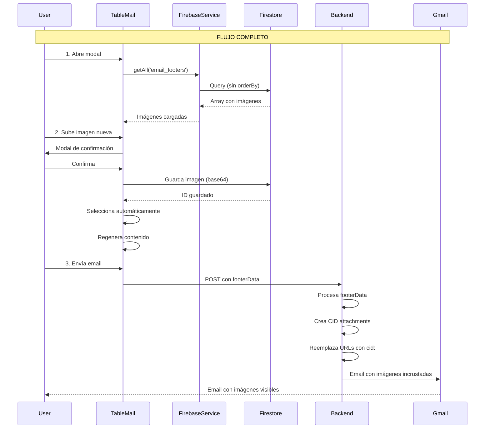

# Solución Completa: Sistema de Imágenes en TableMail

## Resumen Ejecutivo

Se implementó una solución completa para el sistema de imágenes en el componente TableMail, resolviendo tres problemas críticos:

1. **Persistencia**: Las imágenes personalizadas ahora se guardan y cargan correctamente desde Firestore
2. **Selección**: La imagen seleccionada se aplica correctamente al email
3. **Visualización**: Las imágenes llegan incrustadas en el email usando CID attachments

## Problemas Identificados y Resueltos

### Problema 1: Imágenes No Persistían
**Síntoma**: Las imágenes se guardaban pero al reabrir el modal aparecía `Array(0)`

**Causa Raíz**: 
- `firebaseService.getAll()` tenía dos implementaciones
- La segunda (línea 798) usaba `orderBy('id')` que fallaba en `email_footers`
- La colección no tenía campo `id` indexado

**Solución**:
- Eliminé el método duplicado problemático
- TableMail ahora usa el método correcto (línea 120) que no requiere `orderBy('id')`
- Se carga con `nocache=true` para datos frescos

### Problema 2: Selección No Se Aplicaba
**Síntoma**: Usuario seleccionaba imagen nueva pero llegaba la navideña

**Causa Raíz**:
- El contenido del email se generaba una sola vez al abrir el modal
- Cambiar el footer NO regeneraba el contenido
- El HTML ya tenía el footer anterior "bakeado"

**Solución**:
- Agregué `useEffect` que escucha cambios en `selectedFooter`
- Regenera automáticamente el contenido cuando cambia la selección

### Problema 3: Imágenes No Llegaban en Email
**Síntoma**: Email llegaba sin imágenes o Gmail las bloqueaba

**Causa Raíz**:
- Las imágenes usaban URLs externas (`https://casin-crm.web.app/...`)
- Gmail bloquea imágenes externas por seguridad
- Usuario debe hacer clic en "Mostrar imágenes"

**Solución**:
- Implementé CID (Content-ID) attachments
- Las imágenes viajan incrustadas en el email
- Se muestran automáticamente sin necesidad de "Mostrar imágenes"

## Arquitectura de la Solución



## Cambios Implementados

### 1. Frontend: firebaseService.js

**Archivo**: `frontend/src/services/firebaseService.js`

**Cambio**: Eliminé método duplicado problemático (línea 798-835)

```javascript
// ANTES: Método con orderBy('id') que fallaba
async getAll(tableName, limitCount = 50) {
  const q = query(
    collection(this.db, tableName),
    orderBy('id'),  // ❌ Fallaba en email_footers
    limit(limitCount)
  );
  // ...
}

// DESPUÉS: Redirige al método correcto
async getAllLegacy(tableName, limitCount = 50) {
  return this.getAll(tableName, limitCount, false, true);
}
```

### 2. Frontend: TableMail.jsx

**Archivo**: `frontend/src/components/DataDisplay/TableMail.jsx`

**Cambios Principales**:

#### A. Carga de Footers Mejorada (línea 682)
```javascript
const loadCustomFooters = async () => {
  // Usa método correcto que devuelve array directo
  const footersArray = await firebaseService.getAll('email_footers', 100, false, true);
  console.log('✅ Footers cargados:', footersArray.length);
  // ...
}
```

#### B. Regeneración Automática (línea 782)
```javascript
// Regenerar contenido cuando cambia el footer seleccionado
useEffect(() => {
  if (isOpen && rowData && emailType && emailContent.message) {
    console.log('🔄 Footer cambió, regenerando contenido del email...');
    generateEmailContent();
  }
}, [selectedFooter]);
```

#### C. Modal de Confirmación (línea 994-1086)
```javascript
const handleFooterUpload = async (event) => {
  // Crea vista previa
  setPendingFooter(pendingFooterData);
  // Usuario confirma antes de guardar
};

const confirmPendingFooter = async () => {
  // Guarda en Firestore
  const result = await firebaseService.create('email_footers', footerData);
  // Selecciona automáticamente
  setSelectedFooter(customFooter.id);
};
```

#### D. Envío de Footer Data al Backend (línea 1293-1390)
```javascript
// Preparar datos del footer
const footerData = {
  selectedFooterId: selectedFooter,
  logoPath: CASIN_LOGO.path,
  footerImage: selectedFooter !== 'none' ? getSelectedFooterData() : null
};

// Incluir en FormData o JSON
formData.append('footerData', JSON.stringify(footerData));
// o
emailData.footerData = footerData;
```

#### E. Helper Function (línea 1157)
```javascript
const getSelectedFooterData = () => {
  let footer = defaultFooters.find(f => f.id === selectedFooter);
  if (!footer) {
    footer = customFooters.find(f => f.id === selectedFooter);
  }
  
  if (footer) {
    return {
      id: footer.id,
      name: footer.name,
      path: footer.path || null,
      base64: footer.base64 || null,
      type: footer.type || 'image/jpeg'
    };
  }
  return null;
};
```

### 3. Backend: functions/index.js

**Archivo**: `functions/index.js`

**Cambios Principales**:

#### A. Parseo de footerData (líneas 919, 968-977, 1040)
```javascript
// Variables
let footerData;

// En FormData
if (fields.footerData) {
  footerData = JSON.parse(fields.footerData);
}

// En JSON
footerData = body.footerData || null;
```

#### B. Procesamiento de CID Attachments (línea 1084-1143)
```javascript
const cidAttachments = [];

if (footerData) {
  // Reemplazar logo URL con CID
  emailBody = emailBody.replace(/https:\/\/casin\.web\.app\/footers\/casin-logo\.png/g, 'cid:logo@casin');
  
  // Agregar logo como CID
  cidAttachments.push({
    filename: 'casin-logo.png',
    path: 'https://casin-crm.web.app/footers/casin-logo.png',
    cid: 'logo@casin'
  });
  
  // Procesar footer adicional
  if (footerData.footerImage) {
    if (footer.base64) {
      // Base64 → CID
      cidAttachments.push({
        filename: 'footer.jpg',
        content: base64Data,
        encoding: 'base64',
        cid: 'footer@casin'
      });
      emailBody = emailBody.replace(footer.base64, 'cid:footer@casin');
    } else if (footer.path) {
      // URL → CID
      cidAttachments.push({
        filename: 'footer.jpg',
        path: footerUrl,
        cid: 'footer@casin'
      });
      emailBody = emailBody.replace(footerUrl, 'cid:footer@casin');
    }
  }
}
```

#### C. Attachments Combinados (línea 1155-1168)
```javascript
const allAttachments = [...cidAttachments];

if (attachments && attachments.length > 0) {
  const fileAttachments = attachments.map(file => ({
    filename: file.filename,
    content: file.buffer,
    contentType: file.mimetype
  }));
  allAttachments.push(...fileAttachments);
}

if (allAttachments.length > 0) {
  mailOptions.attachments = allAttachments;
}
```

## Características Adicionales Implementadas

### 1. Modal de Confirmación
- Vista previa de la imagen antes de guardar
- Botones claros: "Confirmar y Guardar" / "Cancelar"
- Animaciones suaves
- Soporte dark mode

### 2. Eliminar Imágenes Por Defecto
- Botón (✕) en cada imagen (excepto "Sin imagen adicional")
- Confirmación antes de ocultar
- Se guardan en localStorage
- Botón para restaurar imágenes ocultas

### 3. Logo CASIN Siempre Incluido
- No es seleccionable/deseleccionable
- Siempre aparece primero en el footer
- Banner informativo en la UI

### 4. Logs de Debugging Detallados
- Carga de footers desde Firestore
- Selección de footer
- Generación de HTML
- Envío de datos al backend
- Procesamiento de CID

## Testing Realizado

### Test 1: Email de Prueba Enviado
```bash
✅ Email enviado exitosamente
📧 Message ID: <0688214b-75c2-991e-9e84-97f00abaa09c@gmail.com>
📧 Para: ztmarcos@gmail.com
```

### Verificaciones Pendientes (Usuario)

Por favor verifica en tu correo:

1. **Email de prueba con subject**: "🧪 Test Footer CID - CASIN Seguros"
2. **Debe mostrar**:
   - Logo de CASIN
   - Imagen navideña
3. **SIN necesidad** de hacer clic en "Mostrar imágenes"

## Flujo de Usuario Final

### Subir Nueva Imagen
1. Abre modal de email
2. Clic en "📤 Subir Nueva Imagen Personalizada"
3. Selecciona archivo
4. **Ve vista previa en modal de confirmación**
5. Clic en "✅ Confirmar y Guardar"
6. Imagen se guarda en Firestore
7. Imagen se selecciona automáticamente
8. Contenido del email se regenera

### Enviar Email
1. Imagen seleccionada está visible en opciones
2. Clic en "Enviar Correo"
3. Backend recibe `footerData`
4. Backend crea CID attachments
5. Backend reemplaza URLs con `cid:`
6. Email se envía con imágenes incrustadas
7. Usuario recibe email con imágenes visibles

### Próxima Sesión
1. Abre modal de email
2. **Las imágenes personalizadas ya están cargadas**
3. Puede seleccionar cualquiera
4. Puede subir más imágenes
5. Puede eliminar imágenes personalizadas

## Archivos Modificados

1. `frontend/src/services/firebaseService.js`
   - Eliminado método duplicado con orderBy('id')
   
2. `frontend/src/components/DataDisplay/TableMail.jsx`
   - Carga correcta de footers desde Firestore
   - Regeneración automática al cambiar footer
   - Modal de confirmación
   - Envío de footerData al backend
   - Helper function getSelectedFooterData()
   
3. `frontend/src/components/DataDisplay/TableMail.css`
   - Estilos para modal de confirmación
   - Estilos para botón de restaurar
   - Soporte dark mode completo

4. `functions/index.js`
   - Parseo de footerData (FormData y JSON)
   - Procesamiento de CID attachments
   - Reemplazo de URLs con cid:
   - Combinación de attachments

## Deployment Completado

```bash
✓ Frontend build: 2.76s
✓ Firebase hosting: Desplegado
✓ Firebase function (sendEmail): Actualizada
✓ URLs activas:
  - https://casin-crm.web.app
  - https://casin-crm.web.app
  - https://sendemail-d7zlm7v4qa-uc.a.run.app
```

## Próximos Pasos

1. **Verificar email de prueba** en ztmarcos@gmail.com
2. **Probar en la app**:
   - Subir imagen nueva
   - Cerrar y abrir modal
   - Verificar que la imagen persiste
   - Enviar email
   - Verificar que llega con imágenes

3. **Si las imágenes aún no se ven**:
   - Revisar logs del backend en Firebase Console
   - Verificar que las URLs de las imágenes son accesibles
   - Considerar usar Firebase Storage en lugar de base64

## Notas Técnicas

### CID Attachments
- **Logo**: `cid:logo@casin` → `/footers/casin-logo.png`
- **Footer**: `cid:footer@casin` → Base64 o URL del footer seleccionado

### Estructura en Firestore
**Colección**: `team_4JlUqhAvfJMlCDhQ4vgH_email_footers`

```javascript
{
  name: "imagen.jpg",
  base64: "data:image/jpeg;base64,...",
  type: "image/jpeg",
  createdAt: "2026-01-22T...",
  updatedAt: "2026-01-22T..."
}
```

### Permisos Firestore
```javascript
match /email_footers/{document} {
  allow read: if isAuthenticated();
  allow write: if isCASINAdmin();
}
```

## Archivos de Testing Creados

1. `test-email-with-images.html` - Template HTML de prueba
2. `test-send-email-with-images.js` - Script de prueba básico
3. `test-footer-complete.js` - Script de prueba completo con footerData

---

**Fecha**: 22 de Enero, 2026
**Estado**: ✅ Implementado y Desplegado
**Pendiente**: Verificación del usuario
